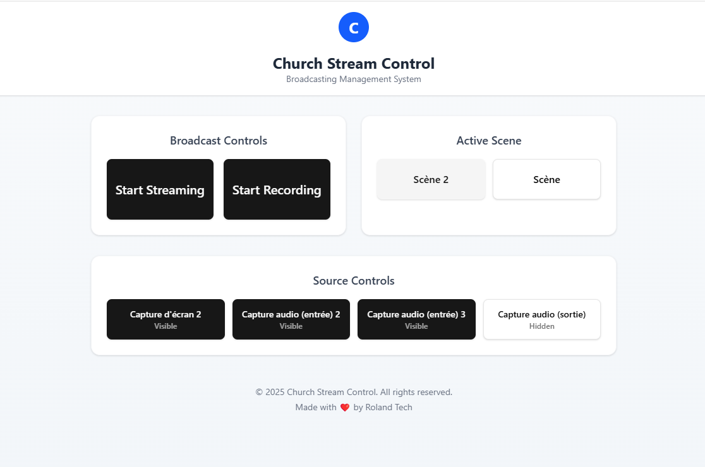

# Church Obs Control

A modern web-based control interface for OBS Studio, designed specifically for church live streaming operations.



## Overview

Church Obs Control is a user-friendly web application that provides a streamlined interface for managing OBS Studio during church live streams. It offers essential controls for streaming, recording, scene switching, and source management, all in a clean and responsive interface.

## Features

- **Live Streaming Controls**
  - One-click stream start/stop
  - Visual status indicators
  - Error handling and status feedback

- **Recording Management**
  - Easy recording controls
  - Status monitoring
  - Safe recording state management

- **Scene Management**
  - Quick scene switching
  - Active scene highlighting
  - Real-time scene list updates

- **Source Controls**
  - Toggle source visibility
  - Visual status indicators
  - Automatic source list updates
  - Multi-source management

- **Responsive Design**
  - Mobile-friendly interface
  - Adaptive layouts
  - Touch-optimized controls

## Technical Requirements

- OBS Studio 28.0.0 or later
- OBS WebSocket 5.0.0 or later
- Node.js 16.0.0 or later
- npm or yarn package manager

## Installation

1. **Clone the Repository**
```bash
git https://github.com/Amedon-Roland/church-obs-control.git
cd church-obs-control
```

2. **Install Dependencies**
```bash
npm install
```

3. **Configure OBS WebSocket**
   - Open OBS Studio
   - Navigate to `Tools` > `WebSocket Server Settings`
   - Enable WebSocket server
   - Set port to `4455` (default)
   - **For security in production, enable authentication**

4. **Start Development Server**
```bash
npm run dev
```

5. **Access the Application**
   - Open your browser
   - Navigate to [http://localhost:3000](http://localhost:3000)

## Usage Guide
### Initial Setup
1. Ensure OBS Studio is running
2. Verify WebSocket connection is established
3. Configure your scenes and sources in OBS

### Streaming
- Click "Start Streaming" to begin broadcast
- Monitor stream status via button color
- Click "Stop Streaming" to end broadcast

### Recording
- Use "Start Recording" for local recording
- Button turns red when recording is active
- Click "Stop Recording" to finish

### Scene Management
- Select scenes from the Active Scene panel
- Current scene is highlighted
- Scene list updates automatically

### Source Control
- Toggle sources on/off with source buttons
- Visual indicators show current state
- Changes reflect immediately in OBS

## Troubleshooting
### Common Issues
1. **Connection Failed**
   - Verify OBS is running
   - Check WebSocket server settings
   - Confirm port `4455` is available

2. **Scenes Not Appearing**
   - Restart OBS
   - Refresh the web interface
   - Check browser console for errors

3. **Controls Not Responding**
   - Verify WebSocket connection
   - Check OBS permissions
   - Clear browser cache

### Error Messages
- **"WebSocket Connection Failed"**: Check OBS and network settings
- **"Scene Switch Failed"**: Verify scene exists in OBS
- **"Recording Error"**: Check disk space and permissions

## Development
### Project Structure
```plaintext
church-obs-control/
├── src/
│   ├── app/
│   │   └── page.tsx       # Main application component
│   ├── components/
│   │   └── ui/           # UI components
│   └── services/
│       └── obsService.ts  # OBS WebSocket service
├── public/
└── package.json
```

### Technology Stack
- Next.js 13+
- React 18
- TypeScript
- Tailwind CSS
- OBS WebSocket API

## Security Considerations
- Enable WebSocket authentication in production
- Use secure HTTPS connections
- Implement user authentication if needed
- Regular security updates

## Contributing
1. Fork the repository
2. Create a feature branch
3. Submit a pull request
4. Follow coding standards
5. Include tests when applicable

## License
© 2025 Church Obs Control. All rights reserved.

## Credits
Made with ❤️ by Roland Tech

## Support
For technical support or feature requests, please contact:
[rolandamedon@gmail.com - 00228 96322545 ]
